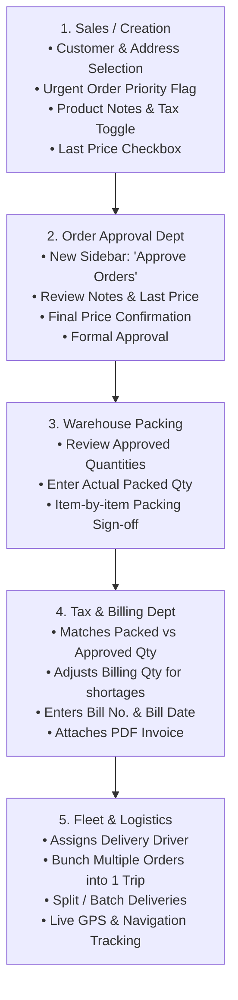

# Silicon Marketing — Complete System & Workflow Architecture Proposal
**Document Type:** Technical & Operational End-to-End Proposal  
**Prepared For:** Family Business Review & Sign-Off  
**Application:** Silicon Marketing Order Management System (OMS) & Fleet App  
**Date:** October 7, 2026  

---

## 1. Executive Summary

This proposal establishes a **frictionless 5-department order fulfillment lifecycle** tailored specifically for Silicon Marketing's wholesale plywood, MDF, and hardware operations.

It eliminates manual coordination friction between sales, pricing approval, warehouse packing, tax invoicing, and logistics. It also introduces **multi-address customer profiles**, **urgent order highlighting**, **split-batch deliveries**, **multi-order trip bunching**, and **strict admin-only order deletion audit policies**.

---

## 2. The 5-Stage Operational Order Pipeline



---

## 3. Department-by-Department Specifications

### Stage 1: Customer & Product Masters

#### A. Customer Master (CRM)
- **Customer Manager:** Dropdown assigning an internal staff/sales member as the responsible manager for this account.
- **Multiple Delivery Addresses:** Supports unlimited addresses per customer (e.g., `Address 1: Main Showroom / Billing`, `Address 2: Site Godown`, `Address 3: Project Site`). Each address includes label, full address, city, pincode, and optional map pin.
- **Priority / Urgent Client Flag:** Option to mark a customer as an express account so their new orders default to Urgent.
- **Privilege Tiers:** Default `Bronze`, with Admin ability to upgrade to `Silver` or `Gold`.
- **Alternative Contact Number:** Secondary phone for site supervisor, purchase manager, or carpenter.
- **GSTIN with Validation:** 15-character length and format checks.
- **Customer ID / Code:** Auto-generated sequentially (e.g. `CUST-1001`), with Admin permission to override/edit with a unique Busy ledger code.
- **Customer Alias:** Editable market nickname (e.g. *Balaji Ply* for *Sri Balaji Traders*).
- **Master Field Control (Admin Dropdown Management):** Admins can configure and decide exactly which options appear in dropdown menus during customer creation (e.g., Customer Managers, Privilege Tiers, Payment Terms, Address Labels) to keep forms clean and standardized.
- **Anti-Duplication Rules:** Strict uniqueness checks on Primary Phone, GSTIN, and Customer Code.

#### B. Product Master (Inventory)
- **Group Name:** Replaced "Category" with "Group Name" matching Busy product groups (e.g., *Plywood Group*, *MDF Group*, *Hardware Group*).
- **Smart Anti-Duplication:** Strictly unique SKU, plus combination uniqueness check:
  $$\text{Group Name} + \text{Product Name} = \text{Unique}$$

---

### Stage 2: Order Creation (`/dashboard/orders/create`)

1. **Auto-Populating Customer Manager:**
   - Once a customer is selected, their assigned **Customer Manager** is displayed automatically as an uneditable badge.
2. **Delivery Address Selector:**
   - A dropdown displays all registered addresses for the selected customer (`Address 1: Main Showroom`, `Address 2: Site Godown`). Staff can select the destination with 1 click or enter a custom one-off delivery location.
3. **Urgent Order Priority Toggle (`isUrgent`):**
   - Toggle: **`⚡ Mark as Urgent Order`** (automatically checked if the customer is flagged as a priority account).
   - **High-Visibility Dashboard Alert:** Urgent orders render across all departmental screens (Dashboard, Orders, Approvals, Packing, Billing) with a **distinctive highlighted row color** (e.g. warm amber/crimson glowing border, soft tint background, and an animated `⚡ URGENT` badge) so teams prioritize them immediately.
4. **Item-Level Notes & Tax Controls:**
   - **Tax Toggle:** A clear switch above the price field: **`Tax Inclusive (MRP)`** vs **`Tax Exclusive (+GST)`**.
   - **Product Notes Field:** A dedicated text box under each item row for creator instructions (e.g., *"Special 3% discount agreed"*, *"Deliver 8x4 size only"*).
   - **"Last Price" Flag:** A checkbox under the price field: `[ ] Apply Last Price`. When checked, flags the approval department to look up and apply the customer's previous invoice rate.

---

### Stage 3: New Department — "Approve Orders" (`/dashboard/approve-orders`)

*Currently, orders go straight from creation to operations. This new department provides pricing and credit control.*

1. **New Sidebar Menu:** Dedicated link in sidebar: **`Approve Orders`** with real-time pending count badge.
2. **Review & Price Finalization:**
   - Approver inspects the order items, product notes, and "Last Price" requests.
   - Approver can adjust the final unit price, discount percentage, and payment terms.
3. **Action:** Click **"Approve Order"** $\rightarrow$ Moves the order status to `APPROVED / READY FOR PACKING`.
   *(Optionally: "Reject / Send Back to Sales" with reason note).*

---

### Stage 4: Warehouse Packing (`/dashboard/packing`)

1. **Approved Quantity Reference:**
   - Warehouse staff sees the exact approved order quantities.
2. **Packed Quantity Entry (`packedQuantity`):**
   - Beside each item, instead of just a binary checkmark, staff enters the exact **Packed Quantity** physically loaded or packed.
   - *Example:* Ordered 100 Sheets $\rightarrow$ Warehouse only has 85 in stock $\rightarrow$ Staff enters `85 Sheets` packed.
3. **Action:** Click **"Mark as Packed"** $\rightarrow$ Saves `packedQuantity` to the database and alerts Billing of any quantity shortages.

---

### Stage 5: Billing Department (`/dashboard/billing`)

1. **Automated Packed vs Approved Reconciliation:**
   - Billing staff sees:
     - `Ordered Qty: 100` | `Packed Qty: 85` | `Discrepancy: -15 (Shortage)`
2. **Flexible Billing Quantity Adjustment:**
   - Billing team can adjust the **Invoiced Quantity** to match `85` so the tax invoice matches physical goods loaded on the truck.
3. **Invoice Submission:**
   - Input **Invoice / Bill Number** (e.g. `INV-26-0842`).
   - Input **Invoice / Bill Date**.
   - **Attach PDF Invoice:** Direct file upload for digital record-keeping and customer access.
4. **Action:** Click **"Mark as Billed"** $\rightarrow$ Order is unlocked for vehicle dispatch.

---

### Stage 6: Fleet Logistics, Multi-Stop Trips & Batch Dispatches

1. **Bunching Multiple Deliveries into 1 Trip (Multi-Drop Routes):**
   - The delivery manager can select **multiple billed orders** going along the same route and assign them to a **single driver in one trip**.
   - The driver app guides the driver through Stop 1 $\rightarrow$ Stop 2 $\rightarrow$ Stop 3 with Google Maps Navigation SDK tracking active throughout.
2. **Split / Batch Deliveries (Partial Dispatches):**
   - For large orders (e.g., 500 sheets), the company can dispatch in batches:
     - **Batch 1 (Today):** 200 sheets packed, billed under Bill #1, dispatched on Truck 1.
     - **Batch 2 (Next Week):** Remaining 300 sheets packed, billed under Bill #2, dispatched on Truck 2.
   - The master order tracks remaining balance until 100% fulfilled.

---

### Stage 7: Strict Audit, Deletion & Cancellation Policy

To protect company finances and maintain an unshakeable audit trail, order deletion is locked down with strict permissions:

1. **Hard Deletion (Admin-Only Privilege):**
   - **No standard employee (Sales, Approval, Packing, Delivery) can delete an order.**
   - Only the **System Administrator / Business Owner** has the security authority to permanently delete an order record.
2. **Order Cancellation Workflow (Authorized Staff):**
   - Authorized staff who need to stop an order can only **Cancel** it (`Status: CANCELLED`).
   - Requires entering a **Mandatory Cancellation Reason** (e.g. *Client cancelled contractor order*, *Price negotiation fell through*).
3. **Permanent Record Preservation:**
   - Cancelled orders are **never erased from the database**.
   - They remain permanently recorded in the order history and timeline, preserving:
     - Exact cancellation timestamp
     - Staff member who authorized the cancellation
     - Written explanation
   - This prevents inventory cover-ups, billing disputes, or lost sales visibility.

---

## 4. Complete Application Database Schema (Prisma ORM)

Below is the complete database schema reflecting all core modules and proposed upgrades:

```prisma
// ─── Enums ────────────────────────────────────────────────────────────────────

enum UserRole {
  ADMIN
  SALES
  BILLING
  PACKING
  DELIVERY
}

enum PrivilegeTier {
  BRONZE
  SILVER
  GOLD
}

enum ProductUnit {
  SHEET
  PIECE
  SQFT
  BOX
  KG
  METER
}

enum OrderStatus {
  CONFIRMED
  PROCESSING
  READY
  DISPATCHED
  DELIVERED
  CANCELLED
}

enum BillingState {
  PENDING
  GENERATED
  ERROR
  ON_HOLD
}

enum PackingState {
  PENDING
  IN_PROGRESS
  PACKED
  ON_HOLD
}

enum DeliveryState {
  WAITING
  ASSIGNED
  DISPATCHED
  DELIVERED
  ON_HOLD
}

enum OrderRequestStatus {
  PENDING
  CONFIRMED
  DECLINED
}

enum PaymentState {
  UNPAID
  PARTIAL
  PAID
  OVERDUE
}

// ─── Models ───────────────────────────────────────────────────────────────────

model User {
  id        String   @id @default(uuid())
  name      String
  email     String   @unique
  password  String
  role      UserRole @default(SALES)
  avatar    String?
  isActive  Boolean  @default(true)
  createdAt DateTime @default(now())
  updatedAt DateTime @updatedAt

  // Relations
  salesOrders       Order[]         @relation("SalesPerson")
  managedCustomers  Customer[]      @relation("CustomerManager")
  billingActions    BillingStatus[] @relation("BillingUser")
  packingAssigned   PackingStatus[] @relation("PackingUser")
  timelineEntries   OrderTimeline[] @relation("TimelineUser")
  chatMessages      ChatMessage[]   @relation("UserChatMessages")
  confirmedRequests OrderRequest[]  @relation("ConfirmedByUser")
  recordedPayments  PaymentRecord[] @relation("RecordedPayments")
  cancelledOrders   Order[]         @relation("CancelledByUser")

  @@map("users")
}

model ChatMessage {
  id        String   @id @default(uuid())
  content   String   @db.Text
  userId    String
  createdAt DateTime @default(now())

  // Relations
  user User @relation("UserChatMessages", fields: [userId], references: [id])

  @@index([createdAt])
  @@map("chat_messages")
}

model ProductGroup {
  id          String   @id @default(uuid())
  name        String   @unique
  description String?
  isActive    Boolean  @default(true)
  createdAt   DateTime @default(now())
  updatedAt   DateTime @updatedAt

  // Relations
  products Product[]

  @@map("product_groups")
}

model Product {
  id             String       @id @default(uuid())
  sku            String       @unique
  name           String
  groupId        String
  unit           String       @default("SHEET")
  price          Decimal      @db.Decimal(10, 2)
  stock          Int          @default(0)
  hsnCode        String?
  taxRate        Decimal?     @db.Decimal(5, 2)
  hasVariants    Boolean      @default(false)
  variantOptions Json?
  variants       Json?
  isActive       Boolean      @default(true)
  createdAt      DateTime     @default(now())
  updatedAt      DateTime     @updatedAt

  // Relations
  group             ProductGroup       @relation(fields: [groupId], references: [id])
  orderItems        OrderItem[]
  orderRequestItems OrderRequestItem[]

  @@unique([groupId, name])
  @@map("products")
}

model Customer {
  id                String        @id @default(uuid())
  customerCode      String        @unique
  name              String
  company           String
  alias             String?
  phone             String        @unique
  alternatePhone    String?
  email             String?
  customerManagerId String?
  privilegeTier     PrivilegeTier @default(BRONZE)
  isPriorityClient  Boolean       @default(false)
  gstNumber         String?       @unique
  paymentTerms      String        @default("30 Days")
  isActive          Boolean       @default(true)
  createdAt         DateTime      @default(now())
  updatedAt         DateTime      @updatedAt

  // Relations
  customerManager User?             @relation("CustomerManager", fields: [customerManagerId], references: [id])
  addresses       CustomerAddress[]
  orders          Order[]

  @@map("customers")
}

model CustomerAddress {
  id          String   @id @default(uuid())
  customerId  String
  label       String   @default("Address 1 (Main Showroom)")
  addressLine String
  city        String?
  state       String?  @default("Karnataka")
  pincode     String?
  landmark    String?
  latitude    Float?
  longitude   Float?
  isDefault   Boolean  @default(false)
  createdAt   DateTime @default(now())
  updatedAt   DateTime @updatedAt

  customer Customer @relation(fields: [customerId], references: [id], onDelete: Cascade)

  @@map("customer_addresses")
}

model Supplier {
  id           String   @id @default(uuid())
  name         String
  company      String
  phone        String?
  email        String?
  address      String?
  city         String?
  state        String?
  pincode      String?
  gstNumber    String?
  paymentTerms String   @default("30 Days")
  isActive     Boolean  @default(true)
  createdAt    DateTime @default(now())
  updatedAt    DateTime @updatedAt

  @@map("suppliers")
}

model Order {
  id                String      @id @default(uuid())
  orderNumber       String      @unique
  customerId        String
  salesPersonId     String
  deliveryAddressId String?
  deliveryAddress   String
  isUrgent          Boolean     @default(false)
  orderDate         DateTime    @default(now())
  paymentTerms      String
  notes             String?
  totalAmount       Decimal     @db.Decimal(12, 2)
  overallStatus     OrderStatus @default(CONFIRMED)
  cancelReason      String?
  cancelledById     String?
  cancelledAt       DateTime?
  createdAt         DateTime    @default(now())
  updatedAt         DateTime    @updatedAt

  // Relations
  customer       Customer        @relation(fields: [customerId], references: [id])
  salesPerson    User            @relation("SalesPerson", fields: [salesPersonId], references: [id])
  cancelledBy    User?           @relation("CancelledByUser", fields: [cancelledById], references: [id])
  items          OrderItem[]
  dispatchBatches DispatchBatch[]
  billingStatus  BillingStatus?
  packingStatus  PackingStatus?
  deliveryStatus DeliveryStatus?
  paymentStatus  PaymentStatus?
  paymentRecords PaymentRecord[]
  timeline       OrderTimeline[]
  tripRoute      TripRoute?
  orderRequest   OrderRequest?

  @@index([orderDate])
  @@index([overallStatus])
  @@index([customerId])
  @@map("orders")
}

model OrderItem {
  id               String   @id @default(uuid())
  orderId          String
  productId        String
  sku              String
  productName      String
  quantity         Int
  approvedQuantity Int?
  packedQuantity   Int      @default(0)
  billedQuantity   Int?
  unitPrice        Decimal  @db.Decimal(10, 2)
  discount         Decimal  @default(0) @db.Decimal(10, 2)
  taxRate          Decimal  @default(0) @db.Decimal(10, 2)
  taxAmount        Decimal  @default(0) @db.Decimal(10, 2)
  totalPrice       Decimal  @default(0) @db.Decimal(10, 2)
  isTaxInclusive   Boolean  @default(false)
  applyLastPrice   Boolean  @default(false)
  itemNotes        String?

  // Relations
  order   Order   @relation(fields: [orderId], references: [id], onDelete: Cascade)
  product Product @relation(fields: [productId], references: [id])

  @@map("order_items")
}

model BillingStatus {
  id            String       @id @default(uuid())
  orderId       String       @unique
  status        BillingState @default(PENDING)
  invoiceNumber String?
  invoiceDate   DateTime?
  invoicePdfUrl String?
  generatedById String?
  generatedAt   DateTime?
  holdReason    String?
  createdAt     DateTime     @default(now())
  updatedAt     DateTime     @updatedAt

  // Relations
  order       Order @relation(fields: [orderId], references: [id], onDelete: Cascade)
  generatedBy User? @relation("BillingUser", fields: [generatedById], references: [id])

  @@index([status])
  @@map("billing_statuses")
}

model PackingStatus {
  id           String       @id @default(uuid())
  orderId      String       @unique
  status       PackingState @default(PENDING)
  assignedToId String?
  packedAt     DateTime?
  holdReason   String?
  createdAt    DateTime     @default(now())
  updatedAt    DateTime     @updatedAt

  // Relations
  order      Order @relation(fields: [orderId], references: [id], onDelete: Cascade)
  assignedTo User? @relation("PackingUser", fields: [assignedToId], references: [id])

  @@index([status])
  @@map("packing_statuses")
}

model DeliveryStatus {
  id           String        @id @default(uuid())
  orderId      String        @unique
  status       DeliveryState @default(WAITING)
  driverName   String?
  dispatchDate DateTime?
  eta          DateTime?
  deliveredAt  DateTime?
  holdReason   String?
  createdAt    DateTime      @default(now())
  updatedAt    DateTime      @updatedAt

  // Relations
  order Order @relation(fields: [orderId], references: [id], onDelete: Cascade)

  @@index([status])
  @@map("delivery_statuses")
}

model DispatchBatch {
  id              String        @id @default(uuid())
  orderId         String
  tripId          String?
  batchNumber     Int           @default(1)
  invoiceNumber   String?
  invoicePdfUrl   String?
  status          DeliveryState @default(WAITING)
  dispatchedAt    DateTime?
  deliveredAt     DateTime?
  createdAt       DateTime      @default(now())
  updatedAt       DateTime      @updatedAt

  order Order      @relation(fields: [orderId], references: [id], onDelete: Cascade)
  trip  TripRoute? @relation(fields: [tripId], references: [id])

  @@map("dispatch_batches")
}

model PaymentStatus {
  id            String       @id @default(uuid())
  orderId       String       @unique
  status        PaymentState @default(UNPAID)
  amountPaid    Decimal      @default(0) @db.Decimal(12, 2)
  balanceDue    Decimal      @default(0) @db.Decimal(12, 2)
  paymentMethod String?
  referenceNo   String?
  dueDate       DateTime?
  paidAt        DateTime?
  notes         String?
  createdAt     DateTime     @default(now())
  updatedAt     DateTime     @updatedAt

  order Order @relation(fields: [orderId], references: [id], onDelete: Cascade)

  @@index([status])
  @@map("payment_statuses")
}

model PaymentRecord {
  id            String    @id @default(uuid())
  orderId       String
  amount        Decimal   @db.Decimal(12, 2)
  paymentMethod String
  referenceNo   String?
  notes         String?
  recordedById  String?
  isVoided      Boolean   @default(false)
  voidedAt      DateTime?
  voidReason    String?
  createdAt     DateTime  @default(now())

  order      Order @relation(fields: [orderId], references: [id], onDelete: Cascade)
  recordedBy User? @relation("RecordedPayments", fields: [recordedById], references: [id])

  @@index([orderId])
  @@index([createdAt])
  @@map("payment_records")
}

model OrderTimeline {
  id            String   @id @default(uuid())
  orderId       String
  action        String
  description   String
  performedById String
  timestamp     DateTime @default(now())

  order       Order @relation(fields: [orderId], references: [id], onDelete: Cascade)
  performedBy User  @relation("TimelineUser", fields: [performedById], references: [id])

  @@map("order_timeline")
}

model SystemSetting {
  key   String @id
  value String

  @@map("system_settings")
}

model TripRoute {
  id               String          @id @default(uuid())
  orderId          String          @unique
  driverId         String
  driverName       String
  startLat         Float
  startLng         Float
  destLat          Float?
  destLng          Float?
  startTime        DateTime
  endTime          DateTime?
  status           String          @default("IN_TRANSIT")
  breadcrumbs      Json            @default("[]")
  totalDistanceKm  Float           @default(0)
  ratePerKm        Float           @default(15)
  calculatedPayout Float           @default(0)
  durationMinutes  Int?
  createdAt        DateTime        @default(now())
  updatedAt        DateTime        @updatedAt

  order   Order           @relation(fields: [orderId], references: [id], onDelete: Cascade)
  batches DispatchBatch[]

  @@map("trip_routes")
}

model OrderRequest {
  id               String             @id @default(uuid())
  requestNumber    String             @unique
  customerName     String
  companyName      String?
  phone            String
  email            String?
  deliveryAddress  String?
  city             String?
  pincode          String?
  notes            String?
  status           OrderRequestStatus @default(PENDING)
  totalEstimated   Decimal            @default(0) @db.Decimal(12, 2)
  convertedOrderId String?            @unique
  confirmedById    String?
  declinedReason   String?
  createdAt        DateTime           @default(now())
  updatedAt        DateTime           @updatedAt

  items          OrderRequestItem[]
  convertedOrder Order?              @relation(fields: [convertedOrderId], references: [id])
  confirmedBy    User?               @relation("ConfirmedByUser", fields: [confirmedById], references: [id])

  @@index([status])
  @@index([createdAt])
  @@map("order_requests")
}

model OrderRequestItem {
  id             String        @id @default(uuid())
  orderRequestId String
  productId      String?
  sku            String
  productName    String
  quantity       Int
  unit           String        @default("PIECE")
  estimatedPrice Decimal       @db.Decimal(10, 2)

  orderRequest OrderRequest @relation(fields: [orderRequestId], references: [id], onDelete: Cascade)
  product      Product?     @relation(fields: [productId], references: [id])

  @@map("order_request_items")
}
```

---

## 5. Feedback & Agreed Decisions
- [x] **Customer Manager:** Assigned to each customer, auto-populating uneditable on Order Creation.
- [x] **Customer Privilege Tiers:** 3 tiers: `Bronze` (Default), `Silver`, and `Gold`.
- [x] **Customer ID / Code:** Auto-generated (`CUST-1001`), Admin editable with strict uniqueness validation.
- [x] **Multiple Customer Addresses:** Unlimited labeled addresses per customer with 1-click picker on order creation.
- [x] **Urgent Orders:** Toggle during order creation + visual colored highlight rows across dashboard tables.
- [x] **Order Approval Department:** New sidebar menu where approvers verify notes, tax, last price, and confirm rates.
- [x] **Packing with Packed Qty:** Staff records actual physically loaded quantity to track stock shortages.
- [x] **Billing with Invoice PDF:** Compares packed vs ordered, adjusts bill qty, enters bill details, and attaches invoice PDF.
- [x] **Logistics Bunching & Batches:** Multi-order trips for single driver + split-batch partial dispatches with Navigation SDK.
- [x] **Deletion & Cancellation:** Deletion strictly locked to Admin. Approved staff can only Cancel with mandatory reason logged permanently.
